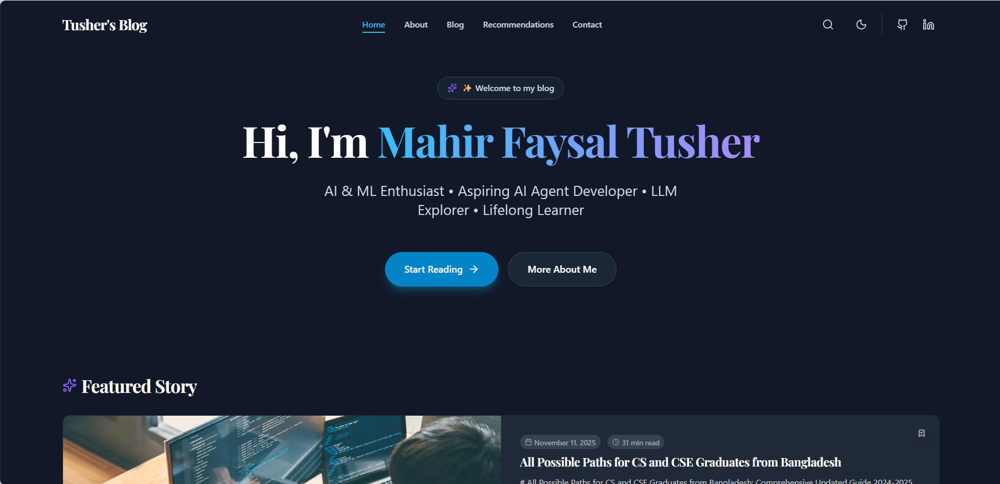

# Personal Platform for a Student Builder

A long-term personal website and content platform for a Computer Science student focused on AI, ML, LLMs, technical projects, learning in public, and intellectual growth.

This repo is not organized like a simple blog anymore. It is designed as a personal operating system with a public frontend and an admin panel that manages the site's core narrative, projects, learning notes, bookshelf, and contact surfaces.



## What This Site Is

The public site is structured around six core areas:

- `Home`
- `My Story`
- `The Lab`
- `The Garden`
- `Bookshelf`
- `Connect`

Together they document:

- what is being learned
- what is being built
- how technical ideas are being understood
- how the author's story is evolving
- what books and reflections are shaping that growth

The architecture is intentionally student-builder-first, while remaining flexible enough to support future research or publication models later.

## Core Product Architecture

### Home

Admin-managed landing page with:

- hero
- current focus
- featured project
- latest learning notes
- story preview
- bookshelf preview
- connect/footer

### My Story

A narrative page built from structured chapters and milestones, not a resume.

### The Lab

Project case studies with structured sections such as:

- problem
- motivation
- approach
- tech stack
- architecture
- implementation
- challenges
- lessons learned
- future improvements

### The Garden

A learning-and-thinking system organized into channels:

- `Active Learning`
- `Knowledge Synthesized`
- `Thinking Notes`

### Bookshelf

A dedicated reading and reflection space for:

- reflections
- reviews
- reading logs
- favorites
- essays

### Connect

Admin-managed links for email, GitHub, and other public contact surfaces.

## Admin-Managed Content

The admin panel controls the meaningful content of the site, not just blog posts.

Current admin areas include:

- `Dashboard`
- `Site Configuration`
- `Profile Settings`
- `Appearance Settings`
- `SEO Settings`
- `UI Text Settings`
- `Homepage Layout`
- `Navigation Settings`
- `Pages`
- `Page Content`
- `Story`
- `Garden`
- `Projects`
- `Bookshelf`
- `CV`
- `Publications`
- `Recommendations`
- `Topics / Tags`
- `Contact Links`
- `Custom Pages`
- `Media Library`
- `Inbox`

## Content Model

The content system is structured around models instead of large JSON blobs wherever possible.

Primary tables include:

- `site_settings`
- `navigation_items`
- `page_sections`
- `page_content`
- `story_chapters`
- `story_milestones`
- `projects`
- `posts`
- `bookshelf_entries`
- `contact_links`
- `publications`
- `recommendations`
- `cv_education`
- `cv_experience`
- `cv_certifications`
- `custom_pages`

This allows the frontend to pull structured content for navigation, homepage sections, stories, Lab case studies, Garden entries, and Bookshelf entries directly from the CMS/data layer.

## Tech Stack

### Frontend

- `Astro 5`
- `React 19`
- `TypeScript`
- `Tailwind CSS`
- `MDX`

### Content and Rendering

- `react-markdown`
- `remark-gfm`
- `remark-math`
- `rehype-highlight`
- `rehype-katex`
- `KaTeX`
- `Mermaid`
- `Shiki` (syntax highlighting)

### Interactive UI

- `react-router-dom 7`
- `lucide-react`
- `yet-another-react-lightbox`
- `Giscus` (comments)

### Feeds and SEO

- RSS and Atom feeds (`/rss.xml`, `/atom.xml`)
- JSON-LD structured data
- Sitemap integration
- PWA manifest and icons

### Backend and Data

- `Supabase`
- `PostgreSQL`
- `Row Level Security`

### Tooling

- `ESLint`
- `Prettier`
- `Vitest`
- `Playwright`

## Project Structure

```text
Blog-Website/
|-- src/
|   |-- components/
|   |   |-- admin/              # Admin panel screens and forms (~30 components)
|   |   |   `-- ui/             # Cosmic-themed admin UI primitives
|   |   |-- astro/              # Server-rendered Astro UI components
|   |   |-- react/              # Client-interactive React components
|   |   |   `-- admin/          # React root for admin panel
|   |   |-- common/             # Shared UI components (LoadingSpinner, etc.)
|   |   |-- markdown/           # Markdown rendering (MarkdownRenderer, CodeBlock, etc.)
|   |   `-- ui/                 # Toast and shared UI primitives
|   |-- config/                 # Site metadata, env access, env validation
|   |-- constants/              # Shared constants
|   |-- content/                # Astro content collections config
|   |-- context/                # React contexts (Bookmarks, CommandPalette, Toast)
|   |-- data/                   # Fallback content when Supabase is unavailable
|   |-- hooks/                  # Data hooks, one per domain
|   |-- layouts/                # Shared layouts (BaseLayout, BlogPostLayout)
|   |-- lib/                    # Utilities (Supabase client, structured data, reading time)
|   |-- pages/                  # Public routes and /admin mount
|   |-- services/               # Supabase CRUD services, one per domain
|   |-- styles/                 # Global CSS and accessibility overrides
|   |-- supabase/               # Low-level Supabase client and raw query helpers
|   |-- types/                  # App and database types, converters
|   `-- utils/                  # Helpers (cn, sanitize, validation)
|-- supabase/
|   |-- schema.sql              # Main SQL schema
|   `-- migrations/             # Incremental SQL migration files
|-- e2e/                        # Playwright end-to-end and visual tests
|-- scripts/                    # Build-time scripts (sitemap, SEO, PWA icons)
|-- docs/                       # Architecture, API, and component documentation
|-- public/                     # Static assets (favicon, PWA icons, OG image)
`-- dist/                       # Production build output
```

## Public Routes

```
/
/story
/lab
/lab/[slug]
/garden
/garden/active-learning
/garden/knowledge-synthesized
/garden/thinking-notes
/garden/[slug]
/bookshelf
/bookshelf/[slug]
/connect
/search
/blog
/blog/[slug]
/blog/tags
/blog/tags/[tag]
/blog/categories/[category]
/cv
/playground
/p/[slug]                  # Custom pages
/admin
/rss.xml
/atom.xml
```

Redirect pages are included for older routes: `/about`, `/projects`, `/recommendations`, and `/contact`.

## Getting Started

### Prerequisites

- `Node.js 18+`
- `npm`
- a Supabase project

### Installation

1. Clone the repository.

```bash
git clone https://github.com/M-F-Tushar/Blog-Website.git
cd Blog-Website
```

2. Install dependencies.

```bash
npm install
```

3. Create a `.env` file in the project root.

```env
PUBLIC_SUPABASE_URL=your_supabase_project_url
PUBLIC_SUPABASE_ANON_KEY=your_supabase_anon_key
```

Legacy `VITE_SUPABASE_URL` and `VITE_SUPABASE_ANON_KEY` are still accepted as fallbacks, but `PUBLIC_*` is now the canonical setup.

4. Apply the schema in `supabase/schema.sql` to your Supabase project.

5. Start the development server.

```bash
npm run dev
```

6. Open the site.

- frontend: `http://localhost:4321`
- admin: `http://localhost:4321/admin`

## Supabase Setup

This project expects the SQL in [supabase/schema.sql](./supabase/schema.sql) to be applied.

That schema includes the core content platform tables, row-level security policies, admin helper objects, and seed data for the new architecture. Incremental changes are tracked as migration files in `supabase/migrations/`, but this branch's structural rewrite assumes the full schema has been applied at least once.

### Create an Admin User

1. Open the Supabase dashboard.
2. Go to `Authentication -> Users`.
3. Create a user for admin access.
4. Confirm the user.
5. Insert that user's UUID into `public.admin_users`.
6. Log in through `/admin`.

## Deployment

The project includes configuration for both Netlify (`netlify.toml`) and Vercel (`vercel.json`). The live site is deployed at `https://mahirfaysaltusherblog.is-a.dev`.

## Available Scripts

- `npm run dev` - start the Astro dev server
- `npm run build` - build the production site
- `npm run preview` - preview the production build locally
- `npm run lint` - run ESLint
- `npm run lint:fix` - auto-fix lint issues where possible
- `npm run format` - format source files
- `npm run format:check` - check formatting
- `npm run test` - run unit tests
- `npm run test:ui` - run Vitest UI
- `npm run test:coverage` - run tests with coverage
- `npm run test:e2e` - run Playwright tests
- `npm run test:e2e:ui` - run Playwright UI mode

## Development Notes

- The site supports fallback content when Supabase is not configured, which helps local UI work continue before the database is wired.
- The `src/data/fallback.ts` file provides static fallback data for all major content domains.
- Some legacy routes and admin modules still exist while the new architecture settles in.
- The lint task currently passes with warnings from older files that have not yet been fully cleaned up.

## Recommended Workflow

When making changes to the content platform:

1. Update the relevant type in `src/types/`.
2. Update the converter in `src/types/converters.ts`.
3. Update the Supabase service in `src/services/`.
4. Update build-time queries in `src/supabase/queries.ts` if the public site needs the data at build time.
5. Update the related admin module/form.
6. Run:

```bash
npm run lint
npm run build
```

## Future Scaling

This architecture is meant to grow over time.

Likely future additions:

- richer topic and series models
- deeper cross-content relations
- a future research or publications section
- more robust media management
- improved homepage section controls

The intent is to add those as new models and modules, not to rebuild the site structure from scratch later.

## Contributing

If you plan to contribute, start with [CONTRIBUTING.md](./CONTRIBUTING.md).

## License

This project is licensed under the MIT License. See [LICENSE](./LICENSE) for details.
